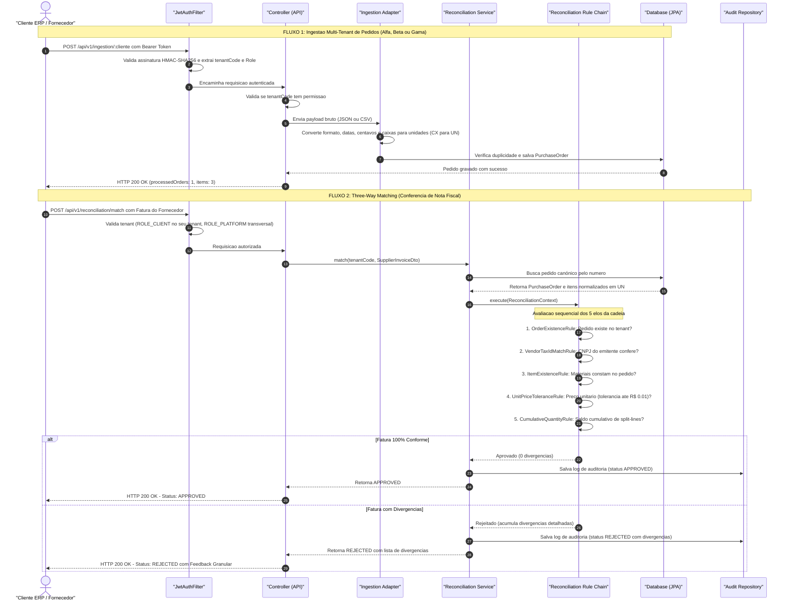

# V360 - Conector de Pedidos de Compra (Purchase Order Integration Gateway)

[](https://openjdk.org/projects/jdk/21/)
[](https://spring.io/projects/spring-boot)
[]()
[](https://www.docker.com/)

API REST corporativa desenvolvida para a plataforma **V360**, responsável por centralizar, normalizar e auditar pedidos de compra (*Purchase Orders*) oriundos de múltiplos sistemas ERP heterogêneos, executando a conferência automatizada de faturas de fornecedores (*Three-Way Matching*) e gerando inteligência de auditoria em suprimentos.

> 🧭 **Navegação Rápida & Destaques de Avaliação:**
> - 📖 **[Relato de Uso de IA (AI_USAGE.md)](file:///D:/Git/v360-case/AI_USAGE.md):** Metodologia *Human-in-the-Loop*, ecossistema de skills do Matt Pocock, grandes decisões de arquitetura e catálogo de prompts formais.
> - 📑 **[Decisões Arquiteturais Registradas (docs/adr/)](file:///D:/Git/v360-case/docs/adr/):** ADR-0001 (Modelo Canônico), ADR-0002 (Chain of Responsibility & Repository Port), ADR-0003 (Preservação de Embalagem Comercial), ADR-0004 (Tenant Code & Slugs) e ADR-0005 (OAuth2 M2M JWT).
> - 🧪 **[Suíte de Testes Automatizados](#6-como-testar-coleções-e-suíte-de-testes):** 106 testes passando com 100% de sucesso (`106 run, 0 failures, 0 errors`).
> - 📮 **[Coleção Postman (v360-collection.json)](file:///D:/Git/v360-case/v360-collection.json)** e **[requests.http](file:///D:/Git/v360-case/requests.http):** Mais de 40 cenários prontos com encadeamento automático de tokens Bearer.

---

## 1. O Problema de Negócio

No ecossistema corporativo de **Procure-to-Pay (P2P)**, empresas compradoras geram ordens de compra em seus próprios sistemas de gestão (ERPs), enquanto fornecedores faturam entregas emitindo Notas Fiscais eletrônicas.

Tradicionalmente, a conciliação entre o que foi comprado e o que foi faturado enfrenta três grandes gargalos:
1. **Heterogeneidade Extrema de Formatos:** Cada cliente exporta dados no padrão do seu ERP (JSONs aninhados da SAP, CSVs tabulares com ponto e vírgula e formatação brasileira do TOTVS Protheus, JSONs planos/achatados com timestamps Unix).
2. **Divergências de Unidade de Compra vs. Faturamento:** Compradores frequentemente adquirem mercadorias em embalagens comerciais fechadas (ex: caixas com 12 unidades), enquanto a Nota Fiscal do fornecedor é faturada estritamente na unidade base física (ex: unidades soltas a preço unitário).
3. **Erros e Fraudes no Recebimento Fiscal:** Notas fiscais com preços superfaturados, quantidades além do saldo em aberto ou cobrança de itens não previstos passam despercebidas quando a conferência é manual.

### O Papel do Gateway V360
A V360 atua como o **barramento inteligente de integração e conciliação**:
- Ingestão multiformato idempotente através de adaptadores isolados (*Ports & Adapters*);
- Normalização transparente para um **Modelo Canônico** em unidade base (`UN`), preservando metadados de embalagem comercial original para auditoria;
- Motor de **Three-Way Matching** baseado no padrão **Chain of Responsibility**, com feedback granular item a item, saldo acumulado e tolerância de arredondamento de até R$ 0,01;
- Isolamento estrito de dados entre clientes concorrentes (*Multi-Tenancy*), com visão analítica consolidada para a operadora da plataforma.

---

## 2. Arquitetura e Decisões de Design

A aplicação adota os princípios da **Arquitetura Hexagonal (Ports & Adapters)**, **Domain-Driven Design (DDD)** e **12-Factor App**.

> 💡 *Para uma visualização isolada dos diagramas, acesse o documento dedicado: [`docs/diagrams/architecture-diagrams.md`](file:///D:/Git/v360-case/docs/diagrams/architecture-diagrams.md).*

### Estrutura do Sistema (Classes e Módulos Agrupados)

```mermaid
graph TB
    subgraph SEC["🔐 Segurança & Multi-Tenancy (OAuth2 / JWT)"]
        JwtFilter["JwtAuthFilter<br/><i>Validação do Bearer Token</i>"]
        JwtSvc["JwtService<br/><i>Claims: tenantCode, role</i>"]
        SecConfig["SecurityConfig<br/><i>Regras de Endpoint & RBAC</i>"]
        SecConfig --> JwtFilter
        JwtFilter --> JwtSvc
    end

    subgraph ING["📥 Camada de Ingestão (Ports & Adapters)"]
        AlfaCtrl["AlfaIngestionController<br/><i>POST /api/v1/ingestion/alfa</i>"]
        AlfaAdp["AlfaJsonAdapter<br/><i>Parse JSON Aninhado (SAP)</i>"]
        
        BetaCtrl["BetaIngestionController<br/><i>POST /api/v1/ingestion/beta</i>"]
        BetaAdp["BetaCsvAdapter<br/><i>Parse CSV RFC 4180 (TOTVS)</i>"]
        
        GamaCtrl["GamaIngestionController<br/><i>POST /api/v1/ingestion/gama</i>"]
        GamaAdp["GamaJsonAdapter<br/><i>Parse Flat JSON + CX->UN</i>"]

        AlfaCtrl --> AlfaAdp
        BetaCtrl --> BetaAdp
        GamaCtrl --> GamaAdp
    end

    subgraph DOM["🏛️ Domínio Canônico (Business Core)"]
        PO["PurchaseOrder<br/><b>Aggregate Root</b><br/>orderNumber, tenantCode, status"]
        POI["PurchaseOrderItem<br/><b>Entity</b><br/>itemNumber, materialCode, unitPrice<br/><i>originalUom, originalQty, convFactor</i>"]
        Vendor["Vendor<br/><b>Value Object</b><br/>taxId, name"]
        PO --> POI
        PO --> Vendor
    end

    subgraph REC["⚙️ Motor Three-Way Matching (Chain of Responsibility)"]
        RecCtrl["ReconciliationController<br/><i>POST /api/v1/reconciliation/match</i>"]
        RecSvc["InvoiceReconciliationService<br/><i>Orquestração do Matching</i>"]
        Chain["ReconciliationRuleChain<br/><i>Execução da Cadeia</i>"]
        
        R1["1. OrderExistenceRule<br/><i>Pedido existe no tenant?</i>"]
        R2["2. VendorTaxIdMatchRule<br/><i>CNPJ bate com fornecedor?</i>"]
        R3["3. ItemExistenceRule<br/><i>Material existe no pedido?</i>"]
        R4["4. UnitPriceToleranceRule<br/><i>Tolerância de até R$ 0,01?</i>"]
        R5["5. CumulativeQuantityRule<br/><i>Saldo cumulativo / split-lines</i>"]
        
        Diverg["ReconciliationDivergenceDto<br/><i>Feedback granular cirúrgico</i>"]

        RecCtrl --> RecSvc
        RecSvc --> Chain
        Chain --> R1
        Chain --> R2
        Chain --> R3
        Chain --> R4
        Chain --> R5
        Chain -.-> Diverg
    end

    subgraph QRY["📊 Consultas & Inteligência Analítica"]
        QueryCtrl["PurchaseOrderController<br/><i>Filtros, Paginação & Saldo</i>"]
        AuditCtrl["ReconciliationAuditController<br/><i>Relatórios de Auditoria</i>"]
    end

    subgraph INFRA["💾 Persistência & Portas de Dados (DIP)"]
        PORepo["PurchaseOrderRepository<br/><i>Interface / Port</i>"]
        AuditRepo["ReconciliationAuditRepository<br/><i>Interface / Port</i>"]
        PGDB[("PostgreSQL 16 / JPA<br/><i>Produção & Docker (H2 em testes)</i>")]
        
        PORepo --> PGDB
        AuditRepo --> PGDB
    end

    %% Conexões entre camadas
    SEC -.->|Isolamento por tenantCode| ING
    SEC -.->|Isolamento por tenantCode| REC
    SEC -.->|Isolamento por tenantCode| QRY

    AlfaAdp -->|Normaliza para| PO
    BetaAdp -->|Normaliza para| PO
    GamaAdp -->|Normaliza para| PO

    ING -->|Salva / Atualiza| PORepo
    RecSvc -->|Consulta Pedido| PORepo
    RecSvc -->|Grava Auditoria| AuditRepo
    QueryCtrl -->|Consulta Pedidos| PORepo
    AuditCtrl -->|Gera Métricas| AuditRepo
```



### Caminho da Requisição (Fluxo Passo a Passo no Sistema)



---

### As 5 Grandes Decisões Arquiteturais do Projeto

O projeto não se limitou a resolver o problema com scripts pontuais; ele foi estruturado em cima de decisões consolidadas de engenharia de software corporativo, todas formalizadas em ADRs (*Architecture Decision Records*):

#### 1. Arquitetura Hexagonal (*Ports & Adapters*) e Modelo Canônico Puro (ADR-0001)
- **O Problema:** Cada cliente corporativo possui um formato e convenção diferente (Alfa com JSON SAP aninhado, Beta com CSVs tabulares separados, Gama com JSON flat e centavos). Acoplar o motor de conferência a esses formatos geraria um sistema frágil e propenso a quebras a cada novo cliente.
- **A Solução:** O núcleo do sistema (`com.v360.gateway.domain`) só conhece o **Modelo Canônico Puro** (`PurchaseOrder`, `PurchaseOrderItem`, `Vendor`, `OrderStatus`).
- **O Benefício:** Cada cliente tem seu próprio adaptador de entrada (`AlfaJsonAdapter`, `BetaCsvAdapter`, `GamaJsonAdapter`). Para plugar uma quarta empresa (seja em XML, EDIFACT ou GraphQL), basta criar um novo adaptador. O core e as regras de conciliação permanecem 100% intactos.

#### 2. Interface Repository como Porta do Domínio (DIP) e Flexibilidade de Banco (ADR-0002)
- **O Problema:** Em muitas aplicações Spring Boot, os serviços e regras de negócio herdam diretamente do `JpaRepository` do Spring Data JPA. Isso amarra o código à infraestrutura relacional, dificultando testes rápidos e tornando quase impossível trocar a tecnologia de banco de dados sem reescrever serviços.
- **A Solução:** Aplicação do **Princípio da Inversão de Dependência (DIP)**. O domínio declara uma interface pura (`PurchaseOrderRepository` no pacote `domain.port`), manipulando apenas objetos canônicos. Os bancos tornam-se meros adaptadores plugáveis de infraestrutura.
- **O Benefício Comprovado:**
  1. **Troca Fácil da Matriz de Persistência:** A migração da base inicial em H2 para **PostgreSQL 16** via Docker Compose foi feita sem alterar uma linha sequer dos serviços de negócio.
  2. **Testes Ultrarrápidos em Memória:** Permitiu criar o `InMemoryPurchaseOrderRepositoryAdapter` (usando `ConcurrentHashMap`), que roda suítes inteiras de teste em frações de segundo sem necessidade de banco de dados rodando.
  3. **Preparado para o Futuro:** Se a empresa quiser migrar para NoSQL (MongoDB) ou banco distribuído (Spanner/CockroachDB), basta criar um novo adaptador que implemente a mesma interface.

#### 3. Padrão GoF *Chain of Responsibility* com Feedback Granular (ADR-0002)
- **O Problema:** Conferir uma fatura contra um pedido envolve múltiplas regras (existência do pedido, CNPJ do fornecedor, existência do item, tolerância de preço, saldo acumulado). Implementar isso com uma cadeia procedural de `if/else` cria um método gigante e difícil de testar.
- **A Solução:** Cada verificação foi isolada como uma classe independente (`ReconciliationRule`) encadeada pelo `ReconciliationRuleChain` (*Chain of Responsibility*), respeitando o Princípio Aberto/Fechado (OCP).
- **O Benefício:** Novas regras fiscais podem ser adicionadas sem risco de quebrar as existentes. Além disso, a API devolve um feedback cirúrgico item a item com as divergências detalhadas:
  ```json
  {
    "status": "REJECTED",
    "divergences": [
      {
        "code": "PRICE_MISMATCH",
        "lineNumber": 1,
        "materialCode": "MAT-1001",
        "description": "Linha 1 (MAT-1001): Preço unitário faturado (R$ 52.00) excede o acordado (R$ 45.90) além da tolerância permitida de R$ 0.01",
        "expectedValue": "45.9000",
        "actualValue": "52.00",
        "difference": "+6.1000"
      }
    ]
  }
  ```

#### 4. Autenticação M2M com Padrão de Mercado OAuth 2.0 Client Credentials & JWT (ADR-0005)
- **O Problema:** A integração entre ERPs e a plataforma é estritamente Máquina-para-Máquina (M2M). Autenticação básica (Basic Auth) ou tokens estáticos não oferecem controle de expiração, claims padronizados nem assinatura criptográfica corporativa.
- **A Solução:** Adoção do padrão global de mercado **OAuth 2.0 Client Credentials Grant** com tokens **JWT** stateless assinados (HMAC-SHA256).
- **O Benefício:** O Spring Security valida as credenciais e emite tokens que carregam o identificador de inquilino (`tenantCode`) e papéis específicos:
  - `ROLE_CLIENT`: Isolamento estrito de tenant (`CLI-ALFA-001`, `CLI-BETA-002`, `CLI-GAMA-003`), impedindo acesso cruzado (`403 FORBIDDEN`);
  - `ROLE_PLATFORM`: Perfil da V360 para conciliações transversais de fornecedores e relatórios analíticos consolidados.

#### 5. Preservação de Rastreabilidade Comercial e Suporte a Tenant Slugs (ADR-0003 & ADR-0004)
- **O Problema:** Ao comprar em caixas (`CX`) com fator de conversão (Cliente Gama), descartar a unidade original na normalização destruiria o valor legal e probatório do pedido caso ocorresse uma divergência física no estoque.
- **A Solução:** Expansão retrocompatível do schema para armazenar os campos de auditoria (`original_uom`, `original_quantity`, `conversion_factor`), enquanto o motor de matching opera na unidade canônica (`UN`).
- **O Benefício:** Rastreabilidade de ponta a ponta sem quebras para clientes legados (Alfa e Beta) e suporte transparente a apelidos amigáveis (*slug aliases* como `clientId=alfa`) resolvidos para o código imutável (`CLI-ALFA-001`).

---

### Decisões Técnicas Menores e Detalhes de Implementação

Além da arquitetura macro, o código incorpora decisões técnicas práticas essenciais para a confiabilidade de um software financeiro e fiscal:

1. **Dinheiro e Precisão Financeira (`BigDecimal` vs. `float`/`double`):**
   - **Por que não usar `float` ou `double`?** Tipos de ponto flutuante binário (padrão IEEE 754) sofrem de erros cumulativos de representação decimal (ex: `0.1 + 0.2 = 0.30000000000000004`). Em compras corporativas de milhares de itens, esses erros gerariam furos contábeis inaceitáveis.
   - **Como foi tratado:** Todas as grandezas monetárias e quantidades utilizam `java.math.BigDecimal` com controle explícito de escala e arredondamento formal (`RoundingMode.HALF_UP`). Preços recebidos em centavos como inteiros (Cliente Gama: `120000`) são divididos com precisão decimal exata por 100 (`R$ 1200.00`).

2. **Tolerância Monetária Absoluta de R$ 0,01:**
   - Na divisão de valores unitários a partir de caixas (ex: R$ 100,00 por uma caixa com 3 unidades = R$ 33,3333...), surgem dízimas infinitas. Uma tolerância monetária absoluta de até **R$ 0,01 por unidade** (`abs(expected - actual) <= 0.01`) foi adotada para evitar rejeições injustas de faturas por frações de centavo, sem abrir as brechas de fraude que uma tolerância percentual abriria em itens de alto valor unitário.

3. **Higienização Canônica de Documentos (CNPJs desmascarados):**
   - Fornecedores são identificados por CNPJ em formatos arbitrários pelos clientes (com máscara `12.345.678/0001-90` ou apenas números `12345678000190`). No construtor do Value Object `Vendor`, qualquer caractere não numérico é descartado via regex (`\D`), garantindo que o Three-Way Matching e as consultas por fornecedor operem sempre de forma determinística e padronizada.

4. **Tratamento de Datas Contábeis com `LocalDate` (Zero Bug de Timezone):**
   - Datas de criação de pedidos e emissão de notas fiscais representam dias fiscais/contábeis fechados, e não instantes de relógio em alta precisão. O uso de `java.time.LocalDate` (formato ISO-8601 `YYYY-MM-DD`) elimina riscos de deslocamento de data causados por fusos horários (por exemplo, meia-noite em Brasília UTC-3 virando 21h do dia anterior em UTC). Timestamps Unix em segundos (Cliente Gama) são convertidos para o calendário local do negócio.

5. **Imutabilidade e Segurança com Java 21 `record`:**
   - DTOs de transporte, Value Objects (`Vendor`) e filtros de consulta foram modelados utilizando `record` do Java 21. Isso assegura imutabilidade inerente (sem setters arbitrários), elimina código boilerplate e garante implementações seguras e consistentes de `equals`, `hashCode` e `toString`.

6. **Idempotência no Processamento de Pedidos (Upsert):**
   - Em caso de falha de conexão ou reenvio automático por parte do ERP cliente, a API não duplica pedidos nem itens. O repositório realiza um *upsert* idempotente baseado no par único (`clientId` + `poNumber`), atualizando o pedido existente e mantendo a integridade histórica.

7. **Tratamento Centralizado de Erros e Exceções (`GlobalExceptionHandler`):**
   - Nenhuma exceção interna ou stacktrace de banco vaza para o consumidor da API. Um manipulador centralizado `@RestControllerAdvice` intercepta falhas de validação (`MethodArgumentNotValidException`) e erros de negócio (`ApiException`), devolvendo respostas HTTP padronizadas com payload estruturado (`timestamp`, `status`, `code`, `message`).

---

## 3. O que mudou da Parte 1 para a Parte 2

> **Seção Obrigatória do Case:** Análise técnica e arquitetural sobre os impactos da inserção do terceiro cliente parceiro (**Cliente Gama Logística**).

Na transição da Parte 1 para a Parte 2, surgiu uma questão central de modelagem:
> *"Uma das mudanças com a inserção da terceira empresa não seria adicionar colunas no banco de dados, já que antes não estava previsto ter fator de conversão e outros campos?"*

### A Resposta Arquitetural e os Trade-offs Analisados:

Ao analisar o impacto da terceira empresa, existiam duas abordagens possíveis:

1. **Abordagem Simplista (Descartar a embalagem de origem):**
   - O adapter converte caixas para unidades na memória e grava apenas `UN` nas colunas existentes.
   - *Problema:* Perda irremediável de rastreabilidade comercial. Se o comprador da Gama abrir o sistema, verá "120 unidades", sem saber que o pedido de compra oficial enviado ao fornecedor foi de "10 caixas". Se houver uma disputa judicial ou comercial sobre avaria de caixas, o sistema perde o valor probatório.

2. **Abordagem Adotada - Normalização com Preservação Comercial (ADR-0003):**
   - **Sim, o schema do banco de dados foi expandido** para acomodar a complexidade do novo parceiro, adicionando 3 novas colunas na tabela `purchase_order_items`:
     - `original_uom` (VARCHAR 20): Unidade de compra da embalagem de origem (ex: `CX`);
     - `original_quantity` (DECIMAL 15,4): Quantidade comprada na embalagem de origem (ex: `10.0000`);
     - `conversion_factor` (DECIMAL 10,4): Fator multiplicador para a unidade base (ex: `12.0000`).
   - **Impacto em Produção (Zero Quebra):** Como os campos de embalagem original são anuláveis (`nullable`), pedidos dos clientes existentes (Alfa e Beta) continuam funcionando perfeitamente sem qualquer quebra de compatibilidade retroativa. Em um banco corporativo (PostgreSQL/Oracle), a alteração ocorreria via script SQL limpo:
     ```sql
     ALTER TABLE purchase_order_items ADD COLUMN original_uom VARCHAR(20);
     ALTER TABLE purchase_order_items ADD COLUMN original_quantity NUMERIC(15,4);
     ALTER TABLE purchase_order_items ADD COLUMN conversion_factor NUMERIC(10,4);
     ```

### Por que o Core da Aplicação Permaneceu Intacto?
Mesmo com a evolução do schema para rastreabilidade, **o motor de Three-Way Matching não precisou de nenhuma alteração**:
- As fórmulas de conversão executadas no `GamaJsonAdapter`:
  $$\text{quantityOrdered} = \text{qtd\_ped} \times \text{fator\_conv}$$
  $$\text{quantityReceived} = \text{qtd\_rec} \times \text{fator\_conv}$$
  $$\text{unitPrice} = \frac{\text{preco\_unit\_centavos} / 100}{\text{fator\_conv}}$$
- O motor de conciliação continua operando estritamente sobre as grandezas canônicas em unidade base (`UN`). Dessa forma, quando a Nota Fiscal do fornecedor chega em unidades soltas a R$ 100,00, a conferência aprova com exatidão matemática sem precisar entender regras de empacotamento do cliente.

---

## 4. Instruções de Execução

### Pré-requisitos
- **Docker** e **Docker Compose** (recomendado para execução em contêiner com PostgreSQL 16);
- Ou **Java 21 LTS** e **Maven 3.9+** (para execução local via `./mvnw`).

### Opção A: Execução Conteinerizada via Docker Compose (1 comando - Recomendada)
```bash
docker compose up --build
```
Sobe a topologia completa de produção conteinerizada:
1. **`v360-postgres` (PostgreSQL 16 Alpine):** Inicializa o banco de dados `v360_db`, cria o volume persistente `postgres_data` e executa healthcheck contínuo via `pg_isready`;
2. **`v360-order-gateway` (Spring Boot 3 / Java 21):** Aguarda o PostgreSQL estar 100% pronto (`service_healthy`), sobe a API em imagem multi-stage com usuário não-root, executa o `DataInitializer` e expõe a porta `8080`.

### Opção B: Execução Local com PostgreSQL
Se você tiver uma instância do PostgreSQL rodando localmente na porta 5432:
```bash
# Windows
.\mvnw.cmd spring-boot:run

# Linux / macOS
./mvnw spring-boot:run
```

### Opção C: Execução Local com H2 em Arquivo (Fallback sem Docker)
Para rodar localmente sem precisar de PostgreSQL instalado:
```bash
# Windows (PowerShell - aspas obrigatórias para parâmetros -D no PowerShell)
.\mvnw.cmd spring-boot:run "-Dspring-boot.run.profiles=h2"

# Windows (Alternativa via variável de ambiente)
$env:SPRING_PROFILES_ACTIVE="h2"; .\mvnw.cmd spring-boot:run

# Linux / macOS (Bash)
./mvnw spring-boot:run -Dspring-boot.run.profiles=h2
```

---

## 5. Endpoints, Documentação e Interfaces

| Recurso | URL / Parâmetros | Descrição |
| :--- | :--- | :--- |
| **Swagger UI** | `http://localhost:8080/swagger-ui.html` | Interface gráfica interativa OpenAPI 3 com autenticação Bearer |
| **OpenAPI JSON**| `http://localhost:8080/v3/api-docs` | Especificação completa da API no formato OpenAPI |
| **PostgreSQL (Docker)** | `localhost:5432` | Banco `v360_db`, usuário `v360_user`, senha `v360_pass` (conectável via DBeaver/psql) |
| **H2 Console (Profile H2)** | `http://localhost:8080/h2-console` | Console H2 habilitado exclusivamente ao utilizar `-Dspring-boot.run.profiles=h2` |
| **Health Check** | `http://localhost:8080/api/v1/health` | Verificação de status e identidade do token |

---

## 6. Como Testar (Coleções e Suíte de Testes)

### 1. Suíte de Testes Automatizados (106 Testes)
```bash
.\mvnw.cmd test     # Windows
./mvnw test         # Linux/macOS
```
Cobre testes unitários, testes de adapters (incluindo tratamento de erros de formato e ausência de campos obrigatórios), regras de matching e testes de integração de controllers com MockMvc:
```text
Results:
Tests run: 106, Failures: 0, Errors: 0, Skipped: 0
BUILD SUCCESS
```

### 2. Arquivo `requests.http` (Mais de 40 Chamadas Prontas)
O arquivo [`requests.http`](file:///D:/Git/v360-case/requests.http) na raiz do projeto está estruturado para execução imediata no VS Code (*REST Client*) ou IntelliJ:
1. **Autenticação no Topo (1 a 4):** Obtenção com 1 clique dos tokens `@tokenAlfa`, `@tokenBeta`, `@tokenGama` e `@tokenPlatform`;
2. **Ingestão Multi-Tenant (5 a 12):** Ingestão de pedidos para Alfa e Beta, upserts idempotentes e validações de segurança 403;
3. **Consultas Canônicas (13 a 19):** Listagem com paginação, filtro de saldo pendente (`onlyPendingBalance=true`), busca por CNPJ de fornecedor, isolamento de tenant e suporte a slug aliases;
4. **Three-Way Matching (20 a 29):** Casos 100% conformes, tolerância de até R$ 0,01, divergência de preço (`PRICE_MISMATCH`), quantidade excedente (`QUANTITY_EXCEEDS_PENDING_BALANCE`), e bloqueio cross-tenant;
5. **Relatórios Analíticos (30 a 34):** Relatório global da plataforma, filtrado por cliente e isolado por tenant;
6. **Parte 2 - Cliente Gama (35 a 40):** Ingestão flat, consulta de pedido com metadados originais de embalagem (`GL-778`), aprovação de nota fiscal em `UN` contra pedido em `CX`, e rejeição por cobrança indevida no valor da caixa.

### 3. Coleção Postman (`v360-collection.json`)
Importe o arquivo [`v360-collection.json`](file:///D:/Git/v360-case/v360-collection.json) no Postman. A coleção já inclui scripts automáticos nos testes de autenticação que salvam os tokens nas variáveis de coleção (`tokenAlfa`, `tokenBeta`, `tokenGama`, `tokenPlatform`).

---

## 7. Credenciais Padrão (M2M OAuth2)

| Cliente | Client ID | Client Secret | Tenant Code | Papel |
| :--- | :--- | :--- | :--- | :--- |
| **Plataforma V360** | `v360-platform` | `platform-secret-123` | `PLATFORM` | `ROLE_PLATFORM` (Superusuário Global) |
| **Cliente Alfa Energia** | `alfa-client` | `alfa-secret-123` | `CLI-ALFA-001` | `ROLE_CLIENT` |
| **Cliente Beta Alimentos** | `beta-client` | `beta-secret-123` | `CLI-BETA-002` | `ROLE_CLIENT` |
| **Cliente Gama Logística** | `gama-client` | `gama-secret-123` | `CLI-GAMA-003` | `ROLE_CLIENT` |

---

## 8. O que eu faria diferente com mais tempo (Próximos Passos de Aprendizado e Evolução)

Como desenvolvedor em início de carreira / estagiário, encaro este projeto como uma grande oportunidade prática de aprendizado em arquitetura corporativa. Com mais tempo disponível para aprofundar a solução, meus focos seriam:

1. **Aprofundar a Cobertura e os Cenários dos Testes Unitários:**
   - Criar mais testes exploratórios simulando arquivos CSV com caracteres corrompidos, quebras de linha irregulares e formatos inesperados de moeda brasileira;
   - Praticar ainda mais a escrita de testes unitários isolados com mocks rápidos para ganhar fluência na metodologia TDD.

2. **Estudar a Escalabilidade e Desempenho da API:**
   - Utilizar ferramentas simples de teste de carga para medir quantas requisições por segundo a aplicação aguenta;
   - Analisar o consumo de memória da JVM e o tempo de resposta do endpoint de Three-Way Matching sob volume de requisições concorrentes;
   - Investigar a criação de índices no PostgreSQL para acelerar buscas frequentes por `client_id` e `po_number`.

3. **Desenvolver uma Interface Web Simples (Dashboard):**
   - Criar uma aplicação frontend simples para que um usuário de negócios possa ver visualmente:
     - A lista de pedidos e seus saldos pendentes;
     - Um painel visual destacando onde as notas fiscais foram reprovadas e qual foi a divergência de preço ou quantidade.

4. **Melhorar os Logs e a Rastreabilidade da Aplicação:**
   - Aprender a configurar logs estruturados, facilitando encontrar erros rapidamente no dia a dia.

