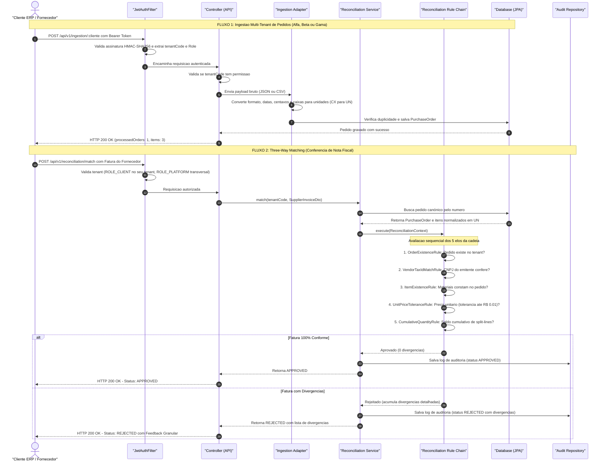

# Diagramas de Arquitetura e Fluxo - V360 Gateway

Este documento centraliza os diagramas visuais do **V360 Conector de Pedidos de Compra**, documentando a estrutura de componentes da aplicação e o caminho percorrido pelas requisições.

---

## 1. Diagrama Estrutural do Sistema (Classes e Módulos Agrupados)

Visão macro das classes e componentes agrupados por camadas funcionais (*Segurança, Ingestão, Domínio Canônico, Motor Three-Way Matching com Chain of Responsibility, Consultas e Persistência*).

```mermaid
graph TB
    subgraph SEC["🔐 Segurança & Multi-Tenancy (OAuth2 / JWT)"]
        JwtFilter["JwtAuthFilter<br/><i>Validação do Bearer Token</i>"]
        JwtSvc["JwtService<br/><i>Claims: tenantCode, role</i>"]
        SecConfig["SecurityConfig<br/><i>Regras de Endpoint & RBAC</i>"]
        SecConfig --> JwtFilter
        JwtFilter --> JwtSvc
    end

    subgraph ING["📥 Camada de Ingestão (Ports & Adapters)"]
        AlfaCtrl["AlfaIngestionController<br/><i>POST /api/v1/ingestion/alfa</i>"]
        AlfaAdp["AlfaJsonAdapter<br/><i>Parse JSON Aninhado (SAP)</i>"]
        
        BetaCtrl["BetaIngestionController<br/><i>POST /api/v1/ingestion/beta</i>"]
        BetaAdp["BetaCsvAdapter<br/><i>Parse CSV RFC 4180 (TOTVS)</i>"]
        
        GamaCtrl["GamaIngestionController<br/><i>POST /api/v1/ingestion/gama</i>"]
        GamaAdp["GamaJsonAdapter<br/><i>Parse Flat JSON + CX->UN</i>"]

        AlfaCtrl --> AlfaAdp
        BetaCtrl --> BetaAdp
        GamaCtrl --> GamaAdp
    end

    subgraph DOM["🏛️ Domínio Canônico (Business Core)"]
        PO["PurchaseOrder<br/><b>Aggregate Root</b><br/>orderNumber, tenantCode, status"]
        POI["PurchaseOrderItem<br/><b>Entity</b><br/>itemNumber, materialCode, unitPrice<br/><i>originalUom, originalQty, convFactor</i>"]
        Vendor["Vendor<br/><b>Value Object</b><br/>taxId, name"]
        PO --> POI
        PO --> Vendor
    end

    subgraph REC["⚙️ Motor Three-Way Matching (Chain of Responsibility)"]
        RecCtrl["ReconciliationController<br/><i>POST /api/v1/reconciliation/match</i>"]
        RecSvc["InvoiceReconciliationService<br/><i>Orquestração do Matching</i>"]
        Chain["ReconciliationRuleChain<br/><i>Execução da Cadeia</i>"]
        
        R1["1. OrderExistenceRule<br/><i>Pedido existe no tenant?</i>"]
        R2["2. VendorTaxIdMatchRule<br/><i>CNPJ bate com fornecedor?</i>"]
        R3["3. ItemExistenceRule<br/><i>Material existe no pedido?</i>"]
        R4["4. UnitPriceToleranceRule<br/><i>Tolerância de até R$ 0,01?</i>"]
        R5["5. CumulativeQuantityRule<br/><i>Saldo cumulativo / split-lines</i>"]
        
        Diverg["ReconciliationDivergenceDto<br/><i>Feedback granular cirúrgico</i>"]

        RecCtrl --> RecSvc
        RecSvc --> Chain
        Chain --> R1
        Chain --> R2
        Chain --> R3
        Chain --> R4
        Chain --> R5
        Chain -.-> Diverg
    end

    subgraph QRY["📊 Consultas & Inteligência Analítica"]
        QueryCtrl["PurchaseOrderController<br/><i>Filtros, Paginação & Saldo</i>"]
        AuditCtrl["ReconciliationAuditController<br/><i>Relatórios de Auditoria</i>"]
    end

    subgraph INFRA["💾 Persistência & Portas de Dados"]
        PORepo["PurchaseOrderRepository<br/><i>Interface / Port</i>"]
        AuditRepo["ReconciliationAuditRepository<br/><i>Interface / Port</i>"]
        PGDB[("PostgreSQL 16 / JPA<br/><i>Produção & Docker (H2 em testes)</i>")]
        
        PORepo --> PGDB
        AuditRepo --> PGDB
    end

    %% Conexões entre camadas
    SEC -.->|Isolamento por tenantCode| ING
    SEC -.->|Isolamento por tenantCode| REC
    SEC -.->|Isolamento por tenantCode| QRY

    AlfaAdp -->|Normaliza para| PO
    BetaAdp -->|Normaliza para| PO
    GamaAdp -->|Normaliza para| PO

    ING -->|Salva / Atualiza| PORepo
    RecSvc -->|Consulta Pedido| PORepo
    RecSvc -->|Grava Auditoria| AuditRepo
    QueryCtrl -->|Consulta Pedidos| PORepo
    AuditCtrl -->|Gera Métricas| AuditRepo
```

---

## 2. Diagrama do Caminho da Requisição (Fluxo de Execução Ponta a Ponta)

Mapeamento do trajeto de execução de duas operações críticas da aplicação: **Ingestão Multi-Tenant** e **Three-Way Matching com Cadeia de Responsabilidade**.

